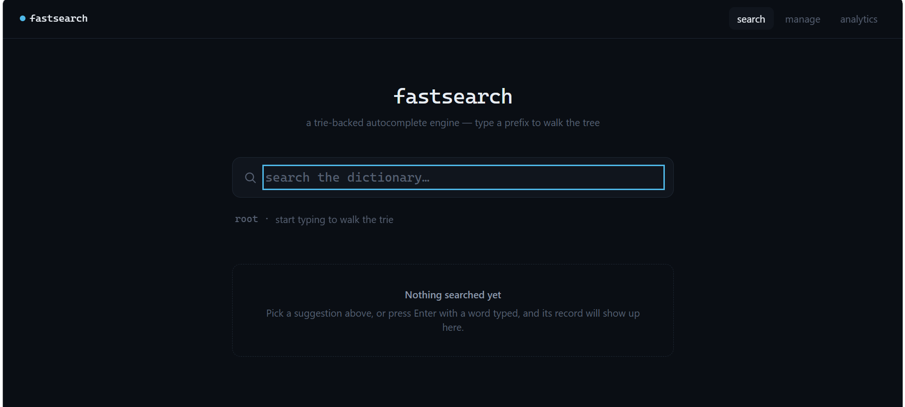
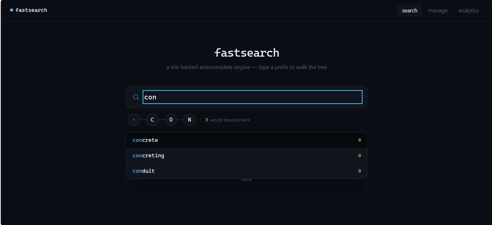
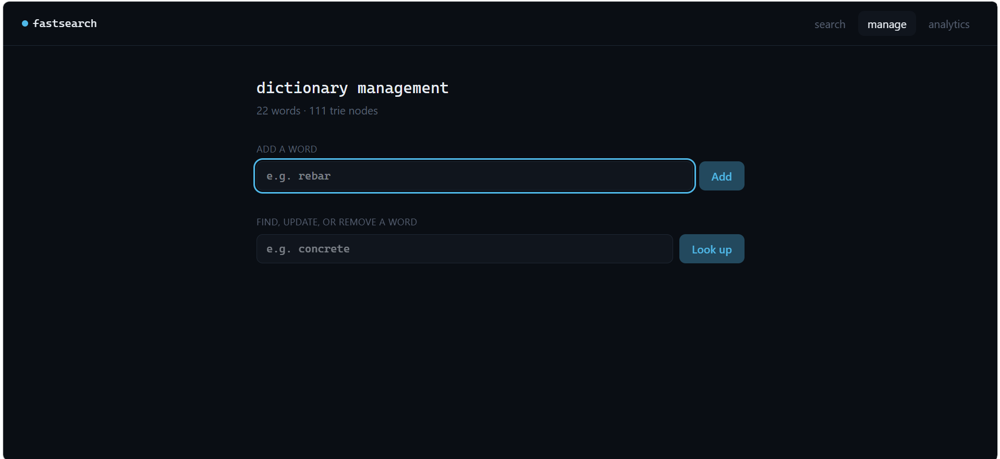

# FastSearch — Trie-Based Intelligent Dictionary & Autocomplete Engine

A prefix-tree search engine built with **C++20**, exposed through a REST API, backed by SQLite, and paired with a React/TypeScript frontend.

FastSearch was built as a personal portfolio project to demonstrate practical knowledge of data structures and algorithms, backend engineering, REST APIs, databases, Docker, and full-stack application architecture.

The project evolved from a single-file console Trie demo into a complete application with persistent storage, autocomplete search, and a web interface.

## Project Showcase

### Search Interface

Search the dictionary through a simple, responsive interface.


### Trie-Based Autocomplete

As a user enters a prefix, FastSearch searches the in-memory Trie and returns matching word suggestions.


### Dictionary Management

Add, look up, and manage dictionary words through the administration interface.


> Screenshot files must be saved using these exact names:
>
> ```text
> docs/screenshots/search.png
> docs/screenshots/suggestions.png
> docs/screenshots/manage.png
> ```

## Architecture

```text
React (Vite/TypeScript) --HTTP--> REST API (C++, httplib) --> SearchService
                                                                  |-- Trie (in-memory index)
                                                                  |-- WordRepository (SQLite)
                                                                  |-- SearchHistoryRepository (SQLite)
```

The Trie is the primary search index at request time. SQLite is the source of truth on disk, and the Trie is rebuilt from it on every startup.

## Features

- Trie-based prefix search and autocomplete
- C++ REST API for dictionary and search operations
- SQLite persistence for dictionary data and search history
- React and TypeScript frontend
- Docker Compose setup for backend, frontend, and persistent data
- Layered architecture separating core logic, storage, services, and API routes
- Automated backend tests
- Persistent Docker volume for database data

## Tech Stack

| Area | Technologies |
|---|---|
| Backend | C++20, CMake, cpp-httplib, nlohmann/json |
| Core data structure | Trie / Prefix Tree |
| Database | SQLite |
| Frontend | React, TypeScript, Vite |
| Testing | GoogleTest |
| Deployment setup | Docker, Docker Compose, Nginx |

## Prerequisites

To run the project locally, install:

- Docker Desktop and Docker Compose for the Docker setup
- CMake and a C++20-compatible compiler for backend development
- Node.js and npm for frontend development

## Run with Docker

Docker is the recommended way to run the complete application.

```bash
docker compose up --build
```

Once the containers start:

- Frontend: <http://localhost:5173>
- Backend API: <http://localhost:8080>
- Health check: <http://localhost:8080/api/health>

The health endpoint should return:

```json
{"status":"ok"}
```

The SQLite database is stored in a named Docker volume named `fastsearch_data`.

```bash
docker compose down
```

This stops the application while preserving dictionary data.

```bash
docker compose down -v
```

This stops the application and removes the stored database volume, resetting it to the seed dataset on the next run.

To connect the frontend to a non-local backend, rebuild it with:

```bash
docker compose build --build-arg VITE_API_BASE_URL=https://api.yourdomain.com frontend
```

## Run Without Docker

### Backend

```bash
cmake -S . -B build -DCMAKE_BUILD_TYPE=Release
cmake --build build -j
./build/fastsearch_tests
./build/fastsearch_server fastsearch.db 8080
```

### Frontend

Open a separate terminal:

```bash
cd frontend
npm install
npm run dev
```

The frontend will be available at <http://localhost:5173>.






## Project Layout

```text
CMakeLists.txt           # Backend build configuration
Dockerfile               # Backend Docker image
docker-compose.yml       # Backend + frontend + persistent volume

src/
  core/                  # Trie, TrieNode, Normalizer; no HTTP or DB knowledge
  db/                    # DatabaseManager, WordRepository, SearchHistoryRepository
  service/               # SearchService; coordinates Trie and database operations
  api/                   # REST routes using httplib and nlohmann/json
  main.cpp               # Startup: load database, build Trie, start server

tests/                   # GoogleTest test suite
third_party/             # Vendored dependencies

frontend/
  src/
    lib/                 # Typed API client and debounce hook
    components/          # SearchBar, TriePath, ResultPanel
    pages/               # SearchPage, AdminPage, DashboardPage
  Dockerfile             # Frontend Docker image
  nginx.conf             # Nginx configuration

docs/
  screenshots/           # README project screenshots
```

## Technical Concepts Demonstrated

- Trie / Prefix Tree implementation
- Prefix-based autocomplete and word lookup
- C++20 development
- REST API design
- SQLite database persistence
- Repository and service-layer patterns
- React and TypeScript frontend development
- Docker and Docker Compose
- Separation of concerns and layered software architecture
- Automated testing with GoogleTest

## Status

The backend, including the Trie, autocomplete/ranking, SQLite persistence, REST API, and frontend, is implemented and tested.

Docker configuration and images are included. Run the following command on a machine with normal Docker Hub access to build and start the full application:

```bash
docker compose up --build
```

## Planned Improvements

- CI pipeline
- Benchmark suite
- Expanded project documentation
- Interview-oriented architecture notes

## Author

Built by **Aniket Raval** as a personal software engineering portfolio project.

The goal of FastSearch is to showcase the progression from implementing a core data structure to designing and building a complete, containerized full-stack application.
